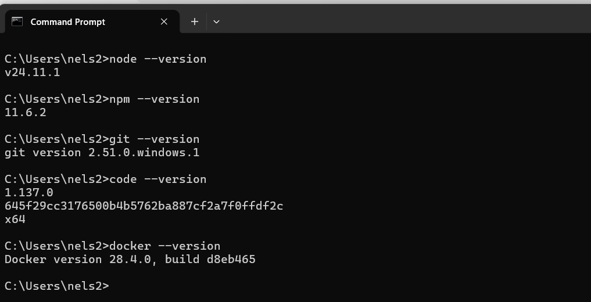
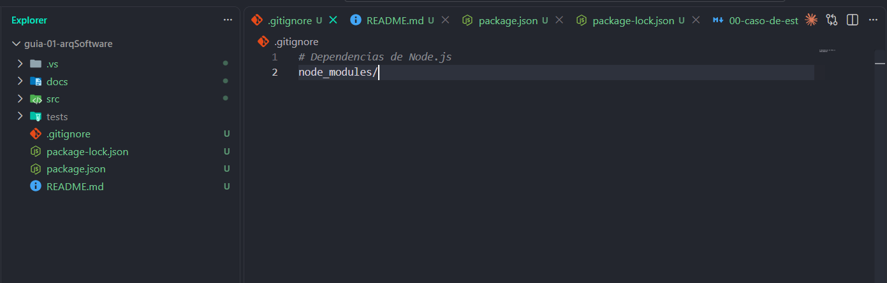

👨‍🎓 Nombre completo: Nelson Garay Curi

-----------------------------------------------------------------------------------------------------------------------

📚 Descripción del curso

El curso de Arquitectura de Software está orientado al estudio de los principios, patrones y técnicas utilizados para diseñar y estructurar sistemas de software de manera organizada, escalable, mantenible y eficiente.

Durante el curso se desarrollarán conocimientos relacionados con la estructura de los sistemas, componentes de software, relaciones entre componentes, patrones arquitectónicos, atributos de calidad y toma de decisiones arquitectónicas.

-----------------------------------------------------------------------------------------------------------------------

🎯 Expectativas del estudiante

Como estudiante de Ingeniería de Sistemas, mis expectativas respecto al curso son:

🏗️ Comprender los fundamentos y principios de la arquitectura de software.

🧩 Aprender a identificar y organizar los componentes que conforman un sistema.

🔄 Conocer y aplicar diferentes patrones y estilos arquitectónicos.

📐 Desarrollar habilidades para diseñar arquitecturas de software estructuradas y mantenibles.

⚙️ Comprender la importancia de atributos de calidad como rendimiento, seguridad, escalabilidad y disponibilidad.

💻 Aplicar los conocimientos adquiridos en proyectos académicos y profesionales.

🚀 Fortalecer mis capacidades como futuro desarrollador de software e ingeniero de sistemas.

-----------------------------------------------------------------------------------------------------------------------

👨‍🏫 Docente: LIZBETH JAICO QUISPE

-----------------------------------------------------------------------------------------------------------------------

📸 Evidencias de la actividad

🔹 Paso 1
Abre una terminal (en Windows: Git Bash o PowerShell) y ejecuta cada comando. Compara con la salida
esperada.

🔹 Paso 2
Crea las siguientes carpetas y archivos vacíos. La estructura es deliberadamente simple.

-----------------------------------------------------------------------------------------------------------------------
👨‍💻 Estudiante: Nelson Garay Curi
Ingeniería de Sistemas — UNSCH

📍 Ayacucho, Perú